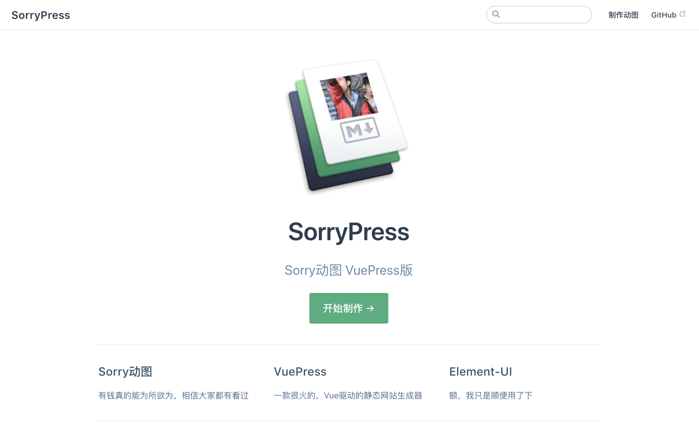

*Inspired by [xtyxtyx/sorry](https://github.com/xtyxtyx/sorry) and [vuejs/vuepress](https://github.com/vuejs/vuepress)*

- [x] VuePress
- [x] Element-UI 1.x
- [x] Koa 2.x
- [x] FFmpeg
- [ ] Docker

### Setup and develop (MacOS)

``` sh
# setup and develop
brew install ffmpeg --with-libass

# server
cd server
npm install
npm run dev

# site
cd site
npm install
npm run dev
```

### Notes

- VuePress支持async/await进行中 [vuejs/vuepress#124](https://github.com/vuejs/vuepress/issues/124)
- 只使用了Element-UI 1.x，因为2.x在VuePress中报错，还没解决 [vuejs/vuepress#80](https://github.com/vuejs/vuepress/pull/80)

``` css
/* 定制SorryPress的logo */
.hero-2 {
  position: absolute;
  transform: rotateX(-21deg) rotateY(-20deg) rotateZ(-17deg);
}
```

``` sh
# 给gif加入字幕
ffmpeg -i wangjingze.gif \
  -vf "ass=wangjingze.ass" \
  -y out.gif
```
